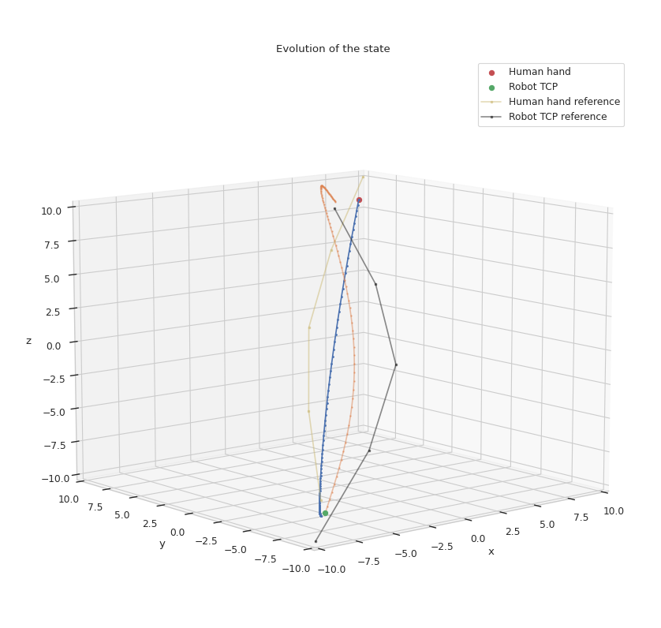
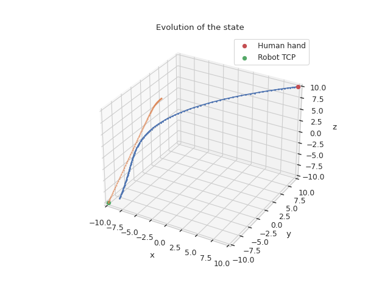

# Common settings

// Initial state
static constexpr float kHumanHandInitialX = 10.0;    // m
static constexpr float kHumanHandInitialY = 10.0;    // m
static constexpr float kHumanHandInitialZ = 10.0;    // m

static constexpr float kRobotTcpInitialX = -10.0;    // m
static constexpr float kRobotTcpInitialY = -10.0;    // m
static constexpr float kRobotTcpInitialZ = -10.0;    // m

static constexpr float kHumanHandInitialVx = 0.0;   // m/s
static constexpr float kHumanHandInitialVy = 0.0;   // m/s
static constexpr float kHumanHandInitialVz = 0.0;   // m/s

static constexpr float kRobotTcpInitialVx = 0.0;    // m/s
static constexpr float kRobotTcpInitialVy = 0.0;    // m/s
static constexpr float kRobotTcpInitialVz = 0.0;    // m/s

// Target state
static constexpr float kHumanHandTargetX = -8.0;    // m
static constexpr float kHumanHandTargetY = -8.0;    // m
static constexpr float kHumanHandTargetZ = -8.0;    // m

static constexpr float kRobotTcpTargetX = 7.0;      // m
static constexpr float kRobotTcpTargetY = 9.0;      // m
static constexpr float kRobotTcpTargetZ = 8.0;      // m

static constexpr float kHumanHandTargetVx = 0.0;   // m/s
static constexpr float kHumanHandTargetVy = 0.0;   // m/s
static constexpr float kHumanHandTargetVz = 0.0;   // m/s

static constexpr float kRobotTcpTargetVx = 0.0;    // m/s
static constexpr float kRobotTcpTargetVy = 0.0;    // m/s
static constexpr float kRobotTcpTargetVz = 0.0;    // m/s

# hand_tcp_point3D_receding_targetPosCost_0

// Cost weights
static constexpr float kHumanHandGoalXCost = 1.0;
static constexpr float kHumanHandGoalYCost = 1.0;
static constexpr float kHumanHandGoalZCost = 1.0;

static constexpr float kRobotTcpGoalXCost = 1.0;
static constexpr float kRobotTcpGoalYCost = 1.0;
static constexpr float kRobotTcpGoalZCost = 1.0;

static constexpr float kHumanHandGoalVxCost = 0.0;
static constexpr float kHumanHandGoalVyCost = 0.0;
static constexpr float kHumanHandGoalVzCost = 0.0;

static constexpr float kRobotTcpGoalVxCost = 0.0;
static constexpr float kRobotTcpGoalVyCost = 0.0;
static constexpr float kRobotTcpGoalVzCost = 0.0;

static constexpr float kHumanHandNominalVxCost = 0.0;
static constexpr float kHumanHandNominalVyCost = 0.0;
static constexpr float kHumanHandNominalVzCost = 0.0;

static constexpr float kRobotTcpNominalVxCost = 0.0;
static constexpr float kRobotTcpNominalVyCost = 0.0;
static constexpr float kRobotTcpNominalVzCost = 0.0;

static constexpr float kHumanHandAccYCost = 0.0;
static constexpr float kHumanHandAccZCost = 0.0;
static constexpr float kHumanHandAccXCost = 0.0;

static constexpr float kRobotTcpAccXCost = 0.0;
static constexpr float kRobotTcpAccYCost = 0.0;
static constexpr float kRobotTcpAccZCost = 0.0;

static constexpr float kProximityCostWeight = 0.0;

**Agents follow a straight path, as expected.**

# hand_tcp_point3D_receding_targetPosControlCost_1

// Cost weights
static constexpr float kHumanHandGoalXCost = 1.0;
static constexpr float kHumanHandGoalYCost = 1.0;
static constexpr float kHumanHandGoalZCost = 1.0;

static constexpr float kRobotTcpGoalXCost = 1.0;
static constexpr float kRobotTcpGoalYCost = 1.0;
static constexpr float kRobotTcpGoalZCost = 1.0;

static constexpr float kHumanHandGoalVxCost = 0.0;
static constexpr float kHumanHandGoalVyCost = 0.0;
static constexpr float kHumanHandGoalVzCost = 0.0;

static constexpr float kRobotTcpGoalVxCost = 0.0;
static constexpr float kRobotTcpGoalVyCost = 0.0;
static constexpr float kRobotTcpGoalVzCost = 0.0;

static constexpr float kHumanHandNominalVxCost = 0.0;
static constexpr float kHumanHandNominalVyCost = 0.0;
static constexpr float kHumanHandNominalVzCost = 0.0;

static constexpr float kRobotTcpNominalVxCost = 0.0;
static constexpr float kRobotTcpNominalVyCost = 0.0;
static constexpr float kRobotTcpNominalVzCost = 0.0;

static constexpr float kHumanHandAccYCost = 1.0;
static constexpr float kHumanHandAccZCost = 1.0;
static constexpr float kHumanHandAccXCost = 1.0;

static constexpr float kRobotTcpAccXCost = 1.0;
static constexpr float kRobotTcpAccYCost = 1.0;
static constexpr float kRobotTcpAccZCost = 1.0;

static constexpr float kProximityCostWeight = 0.0;

**Agents follow a straight path, as expected.**

# hand_tcp_point3D_receding_proximityCost_2

// Cost weights
static constexpr float kHumanHandGoalXCost = 0.1;
static constexpr float kHumanHandGoalYCost = 0.1;
static constexpr float kHumanHandGoalZCost = 0.1;

static constexpr float kRobotTcpGoalXCost = 0.1;
static constexpr float kRobotTcpGoalYCost = 0.1;
static constexpr float kRobotTcpGoalZCost = 0.1;

static constexpr float kHumanHandGoalVxCost = 0.0;
static constexpr float kHumanHandGoalVyCost = 0.0;
static constexpr float kHumanHandGoalVzCost = 0.0;

static constexpr float kRobotTcpGoalVxCost = 0.0;
static constexpr float kRobotTcpGoalVyCost = 0.0;
static constexpr float kRobotTcpGoalVzCost = 0.0;

static constexpr float kHumanHandNominalVxCost = 0.0;
static constexpr float kHumanHandNominalVyCost = 0.0;
static constexpr float kHumanHandNominalVzCost = 0.0;

static constexpr float kRobotTcpNominalVxCost = 0.0;
static constexpr float kRobotTcpNominalVyCost = 0.0;
static constexpr float kRobotTcpNominalVzCost = 0.0;

static constexpr float kHumanHandAccYCost = 0.1;
static constexpr float kHumanHandAccZCost = 0.1;
static constexpr float kHumanHandAccXCost = 0.1;

static constexpr float kRobotTcpAccXCost = 0.1;
static constexpr float kRobotTcpAccYCost = 0.1;
static constexpr float kRobotTcpAccZCost = 0.1;

static constexpr float kProximityCostWeight = 150.0;
constexpr float kMinProximity = 1.0;  // m (threshold to activate proximity cost)

**Agents bend their future trajectories when they foresee coming too close, as expected.**

# hand_tcp_point3D_receding_targetVelCost_3

// Cost weights
static constexpr float kHumanHandGoalXCost = 0.1;
static constexpr float kHumanHandGoalYCost = 0.1;
static constexpr float kHumanHandGoalZCost = 0.1;

static constexpr float kRobotTcpGoalXCost = 0.1;
static constexpr float kRobotTcpGoalYCost = 0.1;
static constexpr float kRobotTcpGoalZCost = 0.1;

static constexpr float kHumanHandGoalVxCost = 5.0;
static constexpr float kHumanHandGoalVyCost = 5.0;
static constexpr float kHumanHandGoalVzCost = 5.0;

static constexpr float kRobotTcpGoalVxCost = 5.0;
static constexpr float kRobotTcpGoalVyCost = 5.0;
static constexpr float kRobotTcpGoalVzCost = 5.0;

static constexpr float kHumanHandNominalVxCost = 0.0;
static constexpr float kHumanHandNominalVyCost = 0.0;
static constexpr float kHumanHandNominalVzCost = 0.0;

static constexpr float kRobotTcpNominalVxCost = 0.0;
static constexpr float kRobotTcpNominalVyCost = 0.0;
static constexpr float kRobotTcpNominalVzCost = 0.0;

static constexpr float kHumanHandAccYCost = 0.1;
static constexpr float kHumanHandAccZCost = 0.1;
static constexpr float kHumanHandAccXCost = 0.1;

static constexpr float kRobotTcpAccXCost = 0.1;
static constexpr float kRobotTcpAccYCost = 0.1;
static constexpr float kRobotTcpAccZCost = 0.1;

static constexpr float kProximityCostWeight = 150.0;
constexpr float kMinProximity = 0.0;  // m (threshold to activate proximity cost)

**Agents tend to slow down immediately, traveling a shorter path, as expected.**

# hand_tcp_point3D_receding_nominalVelCost_4

// Cost weights
static constexpr float kHumanHandGoalXCost = 0.1;
static constexpr float kHumanHandGoalYCost = 0.1;
static constexpr float kHumanHandGoalZCost = 0.1;

static constexpr float kRobotTcpGoalXCost = 0.1;
static constexpr float kRobotTcpGoalYCost = 0.1;
static constexpr float kRobotTcpGoalZCost = 0.1;

static constexpr float kHumanHandGoalVxCost = 5.0;
static constexpr float kHumanHandGoalVyCost = 5.0;
static constexpr float kHumanHandGoalVzCost = 5.0;

static constexpr float kRobotTcpGoalVxCost = 5.0;
static constexpr float kRobotTcpGoalVyCost = 5.0;
static constexpr float kRobotTcpGoalVzCost = 5.0;

static constexpr float kHumanHandNominalVxCost = 10.0;
static constexpr float kHumanHandNominalVyCost = 10.0;
static constexpr float kHumanHandNominalVzCost = 10.0;

static constexpr float kRobotTcpNominalVxCost = 10.0;
static constexpr float kRobotTcpNominalVyCost = 10.0;
static constexpr float kRobotTcpNominalVzCost = 10.0;

static constexpr float kHumanHandAccYCost = 0.1;
static constexpr float kHumanHandAccZCost = 0.1;
static constexpr float kHumanHandAccXCost = 0.1;

static constexpr float kRobotTcpAccXCost = 0.1;
static constexpr float kRobotTcpAccYCost = 0.1;
static constexpr float kRobotTcpAccZCost = 0.1;

static constexpr float kProximityCostWeight = 150.0;
constexpr float kMinProximity = 0.0;  // m (threshold to activate proximity cost)

// Nominal speed
static constexpr float kHumanHandNominalV = -3.0;    // m/s
static constexpr float kRobotTcpNominalV = 1.0;     // m/s

**Agents tend to maintain the specified velocity (points along the trajectory are more evenly spaced), as expected.**

# hand_tcp_point3D_receding_targetTraj_6 (similar to 5)

// ===== Cost weights ===== //
// Target position cost
static constexpr float kHumanHandGoalXCost = 1.0;
static constexpr float kHumanHandGoalYCost = 1.0;
static constexpr float kHumanHandGoalZCost = 1.0;

static constexpr float kRobotTcpGoalXCost = 1.0;
static constexpr float kRobotTcpGoalYCost = 1.0;
static constexpr float kRobotTcpGoalZCost = 1.0;

// Target velocity cost
static constexpr float kHumanHandGoalVxCost = 0.0;
static constexpr float kHumanHandGoalVyCost = 0.0;
static constexpr float kHumanHandGoalVzCost = 0.0;

static constexpr float kRobotTcpGoalVxCost = 0.0;
static constexpr float kRobotTcpGoalVyCost = 0.0;
static constexpr float kRobotTcpGoalVzCost = 0.0;

// Nominal velocity cost
static constexpr float kHumanHandNominalVxCost = 0.0;
static constexpr float kHumanHandNominalVyCost = 0.0;
static constexpr float kHumanHandNominalVzCost = 0.0;

static constexpr float kRobotTcpNominalVxCost = 0.0;
static constexpr float kRobotTcpNominalVyCost = 0.0;
static constexpr float kRobotTcpNominalVzCost = 0.0;

// Control effort (acceleration) cost
static constexpr float kHumanHandAccXCost = 10.0;
static constexpr float kHumanHandAccYCost = 10.0;
static constexpr float kHumanHandAccZCost = 10.0;

static constexpr float kRobotTcpAccXCost = 10.0;
static constexpr float kRobotTcpAccYCost = 10.0;
static constexpr float kRobotTcpAccZCost = 10.0;

// Proximity cost
static constexpr float kProximityCostWeight = 0.0;
constexpr float kMinProximity = 0.0;  // m (threshold to activate proximity cost)

// Final time cost
static constexpr float kHumanHandFinalTimeXCost = 0.0;
static constexpr float kHumanHandFinalTimeYCost = 0.0;
static constexpr float kHumanHandFinalTimeZCost = 0.0;

static constexpr float kRobotTcpFinalTimeXCost = 0.0;
static constexpr float kRobotTcpFinalTimeYCost = 0.0;
static constexpr float kRobotTcpFinalTimeZCost = 0.0;

constexpr float kFinalTimeWindow = 0.5;  // s (threshold to activate final time cost)

// Reference trajectory cost
static constexpr float kHumanHandLaneCostWeight = 10.0;
static constexpr float kRobotTcpLaneCostWeight = 100.0;

// ===== END Cost weights ===== //

// Nominal speed (the sign must be specified!)
static constexpr float kHumanHandNominalV = -3.0;    // m/s
static constexpr float kRobotTcpNominalV = 1.0;     // m/s

// Initial state
static constexpr float kHumanHandInitialX = 10.0;    // m
static constexpr float kHumanHandInitialY = 10.0;    // m
static constexpr float kHumanHandInitialZ = 10.0;    // m

static constexpr float kRobotTcpInitialX = -10.0;    // m
static constexpr float kRobotTcpInitialY = -10.0;    // m
static constexpr float kRobotTcpInitialZ = -10.0;    // m

static constexpr float kHumanHandInitialVx = 0.0;   // m/s
static constexpr float kHumanHandInitialVy = 0.0;   // m/s
static constexpr float kHumanHandInitialVz = 0.0;   // m/s

static constexpr float kRobotTcpInitialVx = 0.0;    // m/s
static constexpr float kRobotTcpInitialVy = 0.0;    // m/s
static constexpr float kRobotTcpInitialVz = 0.0;    // m/s

// Target state
static constexpr float kHumanHandTargetX = -8.0;    // m
static constexpr float kHumanHandTargetY = -8.0;    // m
static constexpr float kHumanHandTargetZ = -8.0;    // m

static constexpr float kRobotTcpTargetX = 7.0;      // m
static constexpr float kRobotTcpTargetY = 9.0;      // m
static constexpr float kRobotTcpTargetZ = 8.0;      // m

static constexpr float kHumanHandTargetVx = 0.0;   // m/s
static constexpr float kHumanHandTargetVy = 0.0;   // m/s
static constexpr float kHumanHandTargetVz = 0.0;   // m/s

static constexpr float kRobotTcpTargetVx = 0.0;    // m/s
static constexpr float kRobotTcpTargetVy = 0.0;    // m/s
static constexpr float kRobotTcpTargetVz = 0.0;    // m/s

**Agents tend to reach the goal, but keeping close to the reference trajectory, as expected.**

# hand_tcp_point3D_receding_finalTimeCost_7

// ===== Cost weights ===== //
// Target position cost
static constexpr float kHumanHandGoalXCost = 1.0;
static constexpr float kHumanHandGoalYCost = 1.0;
static constexpr float kHumanHandGoalZCost = 1.0;

static constexpr float kRobotTcpGoalXCost = 1.0;
static constexpr float kRobotTcpGoalYCost = 1.0;
static constexpr float kRobotTcpGoalZCost = 1.0;

// Target velocity cost
static constexpr float kHumanHandGoalVxCost = 0.0;
static constexpr float kHumanHandGoalVyCost = 0.0;
static constexpr float kHumanHandGoalVzCost = 0.0;

static constexpr float kRobotTcpGoalVxCost = 0.0;
static constexpr float kRobotTcpGoalVyCost = 0.0;
static constexpr float kRobotTcpGoalVzCost = 0.0;

// Nominal velocity cost
static constexpr float kHumanHandNominalVxCost = 1.0;
static constexpr float kHumanHandNominalVyCost = 1.0;
static constexpr float kHumanHandNominalVzCost = 1.0;

static constexpr float kRobotTcpNominalVxCost = 1.0;
static constexpr float kRobotTcpNominalVyCost = 1.0;
static constexpr float kRobotTcpNominalVzCost = 1.0;

// Control effort (acceleration) cost
static constexpr float kHumanHandAccXCost = 10.0;
static constexpr float kHumanHandAccYCost = 10.0;
static constexpr float kHumanHandAccZCost = 10.0;

static constexpr float kRobotTcpAccXCost = 10.0;
static constexpr float kRobotTcpAccYCost = 10.0;
static constexpr float kRobotTcpAccZCost = 10.0;

// Proximity cost
static constexpr float kProximityCostWeight = 0.0;
constexpr float kMinProximity = 1.0;  // m (threshold to activate proximity cost)

// Final time cost (can be applied to any cost to activate it after a given elapsed time)
constexpr float kFinalGoalTimeThresh = 1.5;  // s (threshold to activate final time cost on target state)
constexpr float  kFinalTrajTimeThresh = 3.0; // s (threshold to activate final time cost on reference traj)

// Reference trajectory cost
static constexpr float kHumanHandLaneCostWeight = 100.0;
static constexpr float kRobotTcpLaneCostWeight = 100.0;

// ===== END Cost weights ===== //

// Nominal speed (the sign must be specified!)
static constexpr float kHumanHandNominalVx = -3.0;    // m/s
static constexpr float kHumanHandNominalVy = -3.0;    // m/s
static constexpr float kHumanHandNominalVz = -3.0;    // m/s

static constexpr float kRobotTcpNominalVx = 1.0;     // m/s
static constexpr float kRobotTcpNominalVy = 1.0;     // m/s
static constexpr float kRobotTcpNominalVz = 1.0;     // m/s

// Initial state
static constexpr float kHumanHandInitialX = 10.0;    // m
static constexpr float kHumanHandInitialY = 10.0;    // m
static constexpr float kHumanHandInitialZ = 10.0;    // m

static constexpr float kRobotTcpInitialX = -10.0;    // m
static constexpr float kRobotTcpInitialY = -10.0;    // m
static constexpr float kRobotTcpInitialZ = -10.0;    // m

static constexpr float kHumanHandInitialVx = 0.0;   // m/s
static constexpr float kHumanHandInitialVy = 0.0;   // m/s
static constexpr float kHumanHandInitialVz = 0.0;   // m/s

static constexpr float kRobotTcpInitialVx = 0.0;    // m/s
static constexpr float kRobotTcpInitialVy = 0.0;    // m/s
static constexpr float kRobotTcpInitialVz = 0.0;    // m/s

// Target state
static constexpr float kHumanHandTargetX = -8.0;    // m
static constexpr float kHumanHandTargetY = -6.0;    // m
static constexpr float kHumanHandTargetZ = -10.0;    // m

static constexpr float kRobotTcpTargetX = -5.0;      // m
static constexpr float kRobotTcpTargetY = -5.0;      // m
static constexpr float kRobotTcpTargetZ = 10.0;      // m

static constexpr float kHumanHandTargetVx = 0.0;   // m/s
static constexpr float kHumanHandTargetVy = 0.0;   // m/s
static constexpr float kHumanHandTargetVz = 0.0;   // m/s

static constexpr float kRobotTcpTargetVx = 0.0;    // m/s
static constexpr float kRobotTcpTargetVy = 0.0;    // m/s
static constexpr float kRobotTcpTargetVz = 0.0;    // m/s

**One can see an abrupt change in the agents' direction after a given time.**
